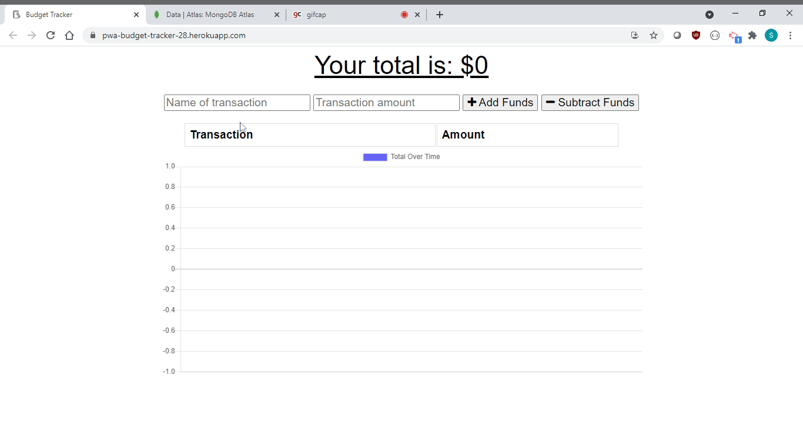

# Budget Tracker

## Description of Project
An easy way to keep track of expenses.  No matter your age, wage, or stage of life, everyone could benefit from an organized budget tracker.  

This app allows users to view, add, and track expenses throughout the week.  A modern day checkbook, you can add to or remove from your cash balance.  Away from wifi, no problem!  This app is downloadable to your phone or laptop and can be used offline.  

Read below for further details.  Enjoy!

## Table of Contents

- [Usage](#usage)
- [Credits and Code Used](#credits-and-code-used)
- [Application Demo](#application-demo)
- [Questions](#questions)
- [Takeaways and Future Development](#takeaways-and-future-development)

## Usage
Check out the Heroku-deployed application [here!](https://pwa-budget-tracker-28.herokuapp.com/)

## Credits and Code Used

- JavaScript/ES6
- Node.js
- Mongoose, mongoDB
- express, mongoose npm packages

## Application Demo

## Questions
Check out my GitHub profile [here.](https://github.com/smcmillan28)

Feel free to send me an email, as well: smcmillan1991@gmail.com

## Takeaways and Future Development

